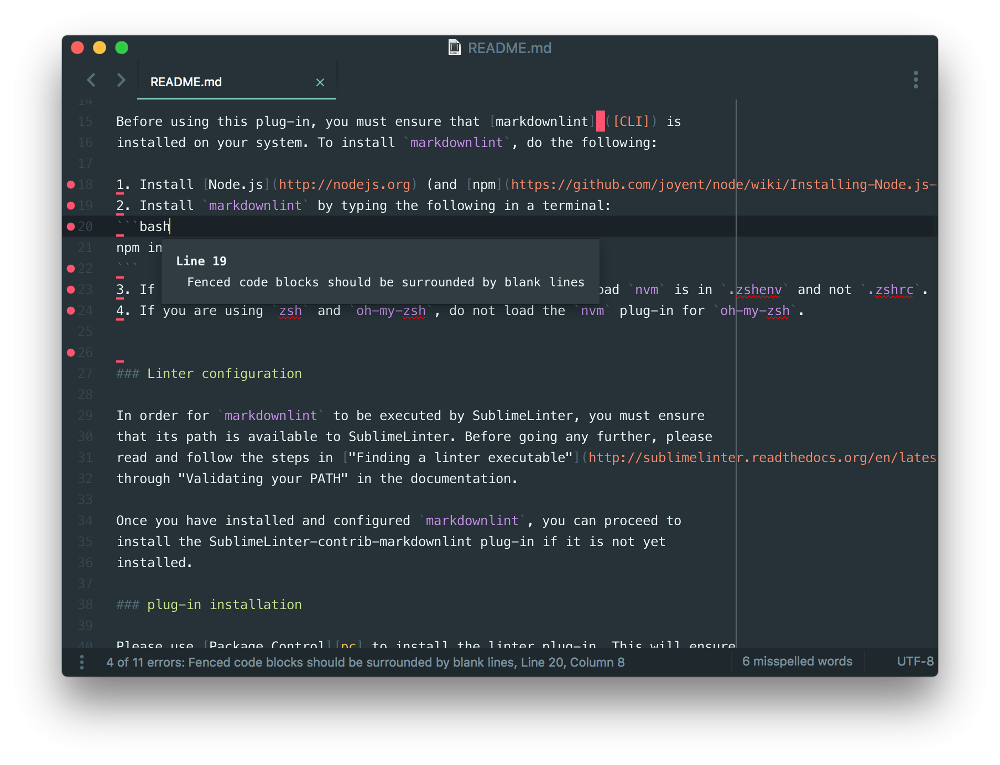

# Sublime Text Markdownlint

[](https://travis-ci.org/jonlabelle/SublimeLinter-contrib-markdownlint "Travis Build Status")
[](https://packagecontrol.io/packages/SublimeLinter-contrib-markdownlint "Package Control Installs")
[](https://github.com/jonlabelle/SublimeLinter-contrib-markdownlint/releases "Latest Version")

> A Sublime Text plug-in for linting Markdown/CommonMark files.



## Installing

[SublimeLinter] must be installed in order to use this plug-in. If
SublimeLinter is not installed, please follow the instructions outlined
[here][installation].

### Install Markdownlint

Before using this plug-in, you must ensure that [markdownlint][CLI] is
installed on your system. To install `markdownlint`, do the following:

1. Install [Node.js](http://nodejs.org).
2. Install `markdownlint` by typing the following in a terminal:

  ```
      npm install -g markdownlint-cli
  ```

3. If you are using `nvm` and `zsh`, ensure that the line to load `nvm` is in
   `.zshenv` and not `.zshrc`.
4. If you are using `zsh` and `oh-my-zsh`, do not load the `nvm` plug-in for
   `oh-my-zsh`.

### Install Sublime Text Markdownlint

Please use [Package Control][pc] to install Sublime Text Markdownlint. This will
ensure that the plug-in will be updated when new versions are available. If you
want to install from source so you can modify the source code, you probably know
what you are doing so we won't cover that here.

To install via [Package Control][pc], do the following:

1. Within Sublime Text, bring up the [Command Palette][cmd] and type `install`.
   Among the commands you should see `Package Control: Install Package`. If that
   command is not highlighted, use the keyboard or mouse to select it. There
   will be a pause of a few seconds while Package Control fetches the list of
   available plug-ins.

2. When the plug-in list appears, type `markdownlint`. Among the entries you
   should see `SublimeLinter-contrib-markdownlint`. If that entry is not
   highlighted, use the keyboard or mouse to select it.

### Markdownlint Configuration Files

Markdownlint configuration files (`.markdownlintrc`) are resolved first by
checking the source directory of file being linted, then by checking the user
`$HOME` path.

To specify a custom Markdownlint configuration path, create a **markdownlint**
section under **linters** in your SublimeLinter User Settings
(`SublimeLinter.sublime-settings`). Then add an `args` key with the appropriate
path to your `--config` file. For example:

```json
{
    "linters": {
        "markdownlint": {
            "args": ["--config", "/custom/path/to/.markdownlintrc"]
        }
    }
}
```

## Contributing

If you would like to contribute enhancements or fixes, please do the following:

1. Fork the plug-in repository.
2. Hack on a separate topic branch created from the latest `master`.
3. Commit and push the topic branch.
4. Make a pull request.
5. Be patient.

Please note that modifications should follow these coding guidelines:

- Indent is 4 spaces.
- Code should pass flake8 and pep257 linters.
- Vertical whitespace helps readability, don't be afraid to use it.
- Please use descriptive variable names, no abbreviations unless they are very
  well known.

## Author

Jon LaBelle

## License

[MIT License]

[SublimeLinter]: http://www.sublimelinter.com/en/latest/
[docs]: http://www.sublimelinter.com/en/latest/
[installation]: http://www.sublimelinter.com/en/latest/
[locating-executables]: http://www.sublimelinter.com/en/latest/troubleshooting.html#finding-a-linter-executable
[pc]: https://packagecontrol.io/packages/SublimeLinter-contrib-markdownlint
[cmd]: http://docs.sublimetext.info/en/sublime-text-3/extensibility/command_palette.html
[settings]: http://www.sublimelinter.com/en/latest/settings.html
[linter-settings]: http://www.sublimelinter.com/en/latest/linter_settings.html
[markdownlint]: https://github.com/DavidAnson/markdownlint
[`markdownlint`]: https://github.com/DavidAnson/markdownlint
[CLI]: https://github.com/igorshubovych/markdownlint-cli
[MIT License]: LICENSE.txt
